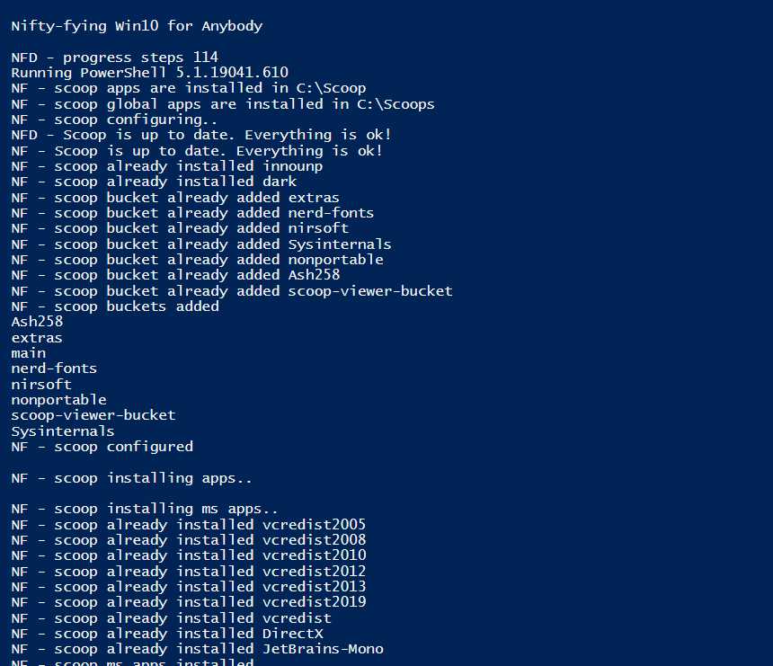
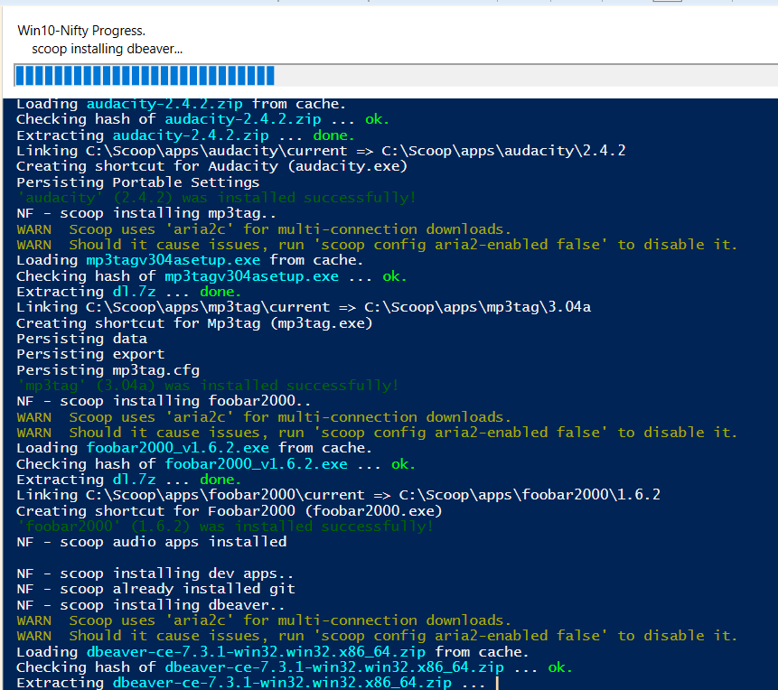

# win10-nifty
Nifty way to install Windows 10 using [scoop](https://scoop-docs.now.sh/)

[scoop](https://scoop-docs.now.sh/) is a command-line installer for Windows, which allows you to script an install, update, modification, etc of your Windows 10

features  
========
* Scripted scoop commands for easy installs
* Scripted configuration
* Progress of install
* Checks for existing installed apps
* Able to configure location of scoop, scoop config, and scooped apps

usage
========
* Download this repo  
* Review and modify scripts  
* Open win10-nifty.ps1 in Powershell ISE or Powershell, then run  
-or-
* Right click on win10-nifty.ps1  
Run as Administrator  
-or-   
Run with Powershell  
  
scripts
=========
* win10-nifty.ps1  
  main script; run this
* env.*.ps1  
  environment configuration scripts, modify as needed  
* scripts/scoop.configure.ps1  
  configures scoop based on envs; adds scoop buckets, aka app repos  
* scripts/scoop.install.*.ps1  
  categorized apps to install; modify as needed
* scripts/helpers.ps1  
  helper methods to reduce scripting, show progress, etc
  

screenshots
========

change log
========
2020-12-30/31 version 0.0.1
* initial version
* split install apps into own scripts
* some basic helpers to facilitate scripting scoop commands

license
========
https://opensource.org/licenses/MIT
